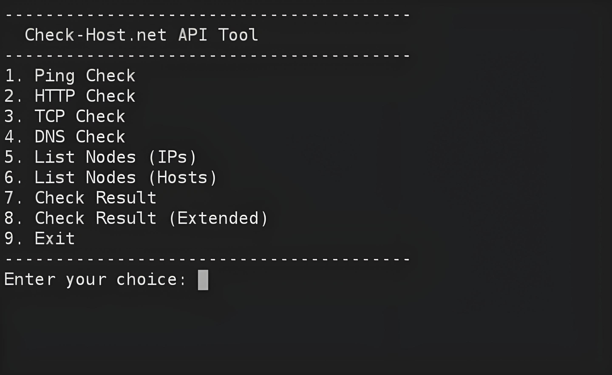

Check-Host.net API Tool

أداة سطر أوامر تفاعلية تستعمل API موقع Check-Host.net
لفحص حالة الهوستات عن طريق Ping وHTTP وTCP وDNS وعرض معلومات النودات

المتطلبات

curl

jq

نظام يدعم bash (مثل لينكس او ترمكس او ماك)


طريقة الاستخدام

1. تأكد من تثبيت curl و jq

بالتيرمكس:
```
pkg install curl jq
```

2. شغل السكربت:
```
bash scan.sh
```

3. راح يطلعلك منيو فيه:

Ping Check : فحص استجابة الهوست

HTTP Check : فحص http للهوست

TCP Check : فحص اتصال TCP للهوست

DNS Check : فحص سجلات DNS

List Nodes (IPs) : عرض عناوين IP للنودات

List Nodes (Hosts) : عرض أسماء النودات

Check Result : عرض نتائج الفحص

Check Result (Extended) : عرض نتائج الفحص بشكل تفصيلي

Exit : للخروج


أمثلة استخدام

فحص ping لموقع:

تدخل اسم الهوست وعدد النودات الي تريد تجرب بيها الفحص

فحص HTTP:

تدخل الهوست بدون بروتوكول (مثلا: example.com)

فحص TCP:

تدخل الهوست ويه البورت (مثلا: google.com:443)

عرض النودات:

يجيبلك قائمة النودات المتوفرة سواء بالـ IP او الاسم

عرض نتيجة الفحص:

تدخل الـ Request ID الي يطلعلك بعد أي فحص حتى تشوف النتيجة


ملاحظة

السكربت يتعامل مع API رسمي لموقع check-host.net

لازم تكون عندك انترنت شغال اثناء الفحص


# scan-web-host-api
